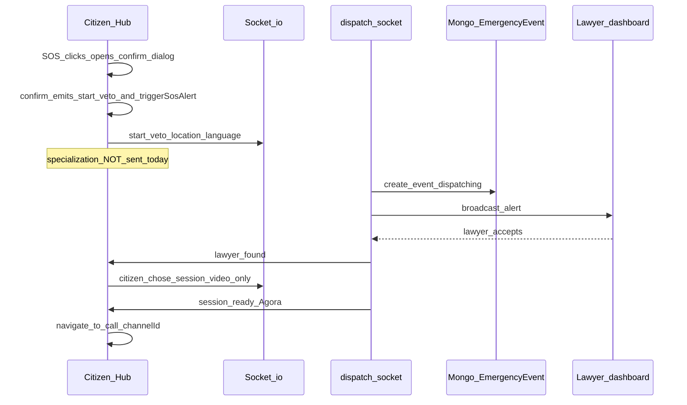

# איפיון תכונות — VETO Web Client (בלי שינוי עיצוב)

מסמך זה מממש את תוכנית העבודה: **תיעוד והגדרת תכונות** בלבד. אינו דורש ואינו משתמע ממנו שינוי CSS, Tailwind או פריסה בקוד.

---

## 1. מלאי תכונות (Feature inventory)

### 1.1 לנדינג / דף הבית (`web-client/src/app/page.tsx`)

| תוכן / תכונה | גרסאות Git (היסטוריה) | HEAD נוכחי |
|--------------|------------------------|------------|
| דף נחיתה ציבורי | `main`: אין (redirect ל־`/login`) | יש לנדינג מלא |
| רקע גלובלי ב־layout | `main`: Unsplash + blur + orbs; `c3803f0`: `courtroom.jpg` + overlay | גרדיאנט אפור־לבן בלבד |
| רקע מקומי לעמוד | — | `bg-[#f6efe1]` |
| לוגו | `b4f0b9e`: טקסט "VETO." | SVG `/veto-logo.svg` |
| ניווט עליון | קישורי # (סדר משתנה בין גרסאות) | מפתחות i18n (`home.nav*`) |
| שפות | — | `LanguageSwitcher` |
| כניסה | שני סגנונות שונים בעבר | קישור אדום + כפתור זהב ל־`/login` |
| באדג׳ "שבתות וחגים" | היה ב־`b4f0b9e` / `d48238e` | **אין** ב־HEAD |
| Bento | תגיות EN קבועות / i18n | שלושה פריטים עם tag+title+desc מ־i18n |

**מסקנה לאיפיון:** פערי **תוכן** מתועדים (למשל באדג׳ שעות שירות); כל שינוי ויזואלי מחוץ לסקופ לפי תוכנית.

### 1.2 דיאלוג בחירת התמחות (מהדבקת המשתמש)

| פריט | בקוד ב-repo | בהדבקה |
|------|-------------|--------|
| קומפוננטה | **אין** | `SpecializationDialog.tsx` |
| i18n | `LocaleProvider` + `t(path)` | `react-i18next` (לא תואם לפרויקט) |
| רשימת התמחויות | — | `criminal`, `traffic`, `civil`, `family`, `labor`, `general` |

### 1.3 הגדרות משתמש

| פריט | בקוד ב-repo | בהדבקה |
|------|-------------|--------|
| נתיב עליון | `/settings` → redirect ל־`/settings/profile` | עמוד יחיד `settings/page.tsx` עם sidebar |
| מעטפת | `SettingsShell`: טאבים כ־`Link` ל־profile / notifications / billing | טאבים: פרופיל, התראות, אבטחה (אין billing בהדבקה) |
| קבצים | `profile/page.tsx`, `notifications/page.tsx`, `billing/page.tsx` | תוכן מאוחד ב־JSX אחד |

### 1.4 כפתור אדום / SOS (אזרח)

| רכיב | מיקום בקוד | תיאור |
|------|-------------|--------|
| כפתור SOS | `web-client/src/app/(citizen)/hub/page.tsx` | עיגול אדום; פותח דיאלוג אישור לפני פעולה |
| דיאלוג אישור | אותו קובץ | כותרת/גוף/ביטול/אישור מ־i18n (`hub.dialog*`) |
| פיצול תשתית | `triggerSosAlert` ב־`app/actions/sos.ts` | שורת תור ב־Prisma + פרסום Ably |
| דיספאץ' בזמן אמת | Socket `start_veto` ב־`backend/src/socket/dispatch.socket.js` | יוצר `EmergencyEvent`, מאתר עו״ד, race-to-accept |
| בחירת סוג שיחה (מוצר) | **חלקי** | אחרי `lawyer_found`, Hub שולח `citizen_chose_session` עם **`video` קבוע** (שורה 100) — אין UI לבחירת אודיו/צ׳ט לפני שיחה |
| אחסון / תמלול | `EmergencyEvent` (Mongo) | שדות `recording_url`, `call_transcript`, `transcript_language` וכו' — קיימים במודל; זרימת מוצר מלאה (PDF, הרשאות עו״ד) דורשת אימות מול `call.controller.js` והכספת ב־web |

---

## 2. איפיון התנהגותי: `SpecializationDialog` (לעתיד — בלי שינוי UI קיים)

### 2.1 Props (ממשק)

| שם | סוג | חובה |
|----|-----|------|
| `isOpen` | `boolean` | כן |
| `onClose` | `() => void` | כן |
| `onSelect` | `(specializationId: string) => void` | כן |

### 2.2 מזהי התמחות (מקור: קוד שהודבק)

| `id` (מומלץ ל־API) | הערה |
|---------------------|------|
| `criminal` | פלילי |
| `traffic` | תעבורה |
| `civil` | באדבקה: civil (מוצר) |
| `family` | משפחה |
| `labor` | עבודה |
| `general` | חירום כללי |

### 2.3 מיפוי לבק־אנד (חובה לסנכרון)

ה־Socket `start_veto` מקבל `specialization` ומשתמש ב־`SPEC_MAP` עם **מפתחות בעברית**:  
`פלילי`, `משפחה`, `נדל"ן`, `עבודה`, `מסחרי`, `תעבורה`  
(ראה `dispatch.socket.js` שורות 87–94).

**דרישת איפיון:** ביישום עתידי יש להגדיר טבלת מיפוי חד־משמעית:  
`id` באנגלית (UI) → ערך/`specialization` שמקובל ב־`SPEC_MAP` או הרחבת ה־map ל־IDs האנגליים.

### 2.4 מצבים והתנהגות

1. `isOpen === false`: לא לרנדר (או null).
2. בחירת כרטיס: מעדכן מצב פנימי `selected` (מזהה אחד).
3. **המשך:** רק אם `selected` מוגדר — קורא `onSelect(selected)`; לא סוגר אוטומטית (ההדבקה לא סוגרת; ניתן לאפיין סגירה אחרי `onSelect` בזרימה העליונה).
4. **ביטול / ✕:** `onClose`.

### 2.5 תשתית טקסט (VETO)

- `LocaleProvider`: רק `t("path.to.key")` — **ללא** ארגומנט ברירת־מחדל שני.
- מפתחות נדרשים בעתיד: `dialog.chooseSpecialization`, `specialization.criminal`, …, `common.cancel`, `common.continue`.

---

## 3. איפיון: מבנה הגדרות (מונוליתי מול נתיבים)

### 3.1 מצב נוכחי (repo)

- `layout.tsx` עוטף ב־`SettingsShell`.
- טאבים: **קישורים** ל־`/settings/profile`, `/notifications`, `/billing`.
- כותרת/תיאור עליון באנגלית קבועה ב־`SettingsShell` ("Settings", "Profile, alerts…").
- **אבטחה:** אין טאב "אבטחה" נפרד; ייתכן חפיפה חלקית עם `./profile` או העדר דף ייעודי להרשאות/סיסמה.

### 3.2 החלטת מוצר (מהמשתמש)

- **מסך מונוליתי עם טאבים** (פרופיל / התראות / אבטחה) כמו בהדבקה.

### 3.3 אפשרויות ניתוב (איפיון בלבד)

| אסטרטגיה | התנהגות | הערה |
|----------|-----------|------|
| A | ` /settings` מרנדר מונולית; `profile`/`notifications` מפנים עם `?tab=` | שומר סימניות ישנות |
| B | מחליף תוכן ב־`page.tsx` יחיד; מוחק או ממזג עמודי משנה | שינוי מבנה קבצים בעתיד |
| C | שומר קבצים נפרדים; `SettingsShell` מעביר ל־children בלבד | פחות "מסך אחד" |

**Billing:** קיים בקוד; בהדבקה לא הופיע — יש להחליט: טאב רביעי, קישור מתחת לפרופיל, או משולב ב"אבטחה/חשבון".

---

## 4. איפיון זרימה: כפתור אדום / SOS (מוצר מול מימוש נוכחי)

### 4.1 מה קורה היום (מבוסס קוד)

### 4.2 דרישות מוצר (תיאור המשתמש) מול פערים

| שלב מוצר | סטטוס בקוד (סיכום) |
|----------|---------------------|
| לחיצה → תפריט 6 התמחויות | **חסר** — אחרי אישור יש ישר `start_veto` בלי `specialization` |
| התאמת עו״ד לפי תחום | **חלקי** — הבק־אנד תומך ב־`specialization` ב־payload; הלקוח לא שולח |
| תיק זמני / removable | **חלקי** — `EmergencyEvent` + `assigned_lawyer_id`; "זמני" דורש כללי מוצר/סטטוס |
| בחירה: וידאו / אודיו / צ׳ט + צ׳ט במהלך וידאו | **חסר ב־UI** — שולחים `video` בלבד; `call_type` במודל תומך ב־`audio`/`chat` |
| הקלטה בכספת, הרשאות, צפייה/מחיקה | דורש אימות מול `call.controller.js` + vault ב־web |
| תמלול לפי שפת אזרח + PDF | שדות קיימים במודל; זרימת UI/ייצוא — לא אומתה כאן במלואה |

### 4.3 קריטריוני קבלה מוצעים (לשלב MVP עתידי)

1. לפני `start_veto`: משתמש בוחר התמחות; ה־payload כולל `specialization` תואם ל־`SPEC_MAP`.
2. לפני כניסה לשיחה: משתמש בוחר `video` | `audio` | `chat`; ערך נשלח ב־`citizen_chose_session`.
3. (שלב מורחב) צ׳ט במקביל לווידאו: להגדיר מודל מוצר (ערוץ נפרד מול Agora) ואחר מכן מימוש.

---

## 5. ישויות API / דATA — הקלטה, כספת, תמלול (סיכום מהבק־אנד)

### 5.1 `EmergencyEvent` (Mongo) — שדות רלוונטיים

- זיהוי משתמשים: `user_id`, `assigned_lawyer_id`
- סטטוס: `dispatching` → `accepted` → `in_progress` → `completed` / `failed` / וכו'
- מיקום: `event_location`, `location_address`
- שפה: `language` (enum: en, he, ar, ru)
- שיחה: `call_type` (`video` | `audio` | `chat` | `pending`), `room_id`
- הקלטה: `recording_url`, `recording_duration_seconds`, `recording_size_bytes`, שדות Agora cloud recording
- תמלול: `call_transcript`, `transcript_language`
- ראיות מוטמעות: מערך `evidence[]` (סוג, `cloud_url`, GPS, משך)

### 5.2 נקודות האחה ל־API (להמשך תיעוד במסמכי OpenAPI)

- לבדוק `backend/src/controllers/call.controller.js`: גישה לרקורדינג/תמלול, הרשאות `assigned_lawyer_id` / בעלים.
- כספת אזרח (`web-client` vault): שירות נפרד (Prisma/Neon לפי הפרויקט) — להגדיר האם הקלטות SOS מקושרות לפריטי vault אוטומטית או רק URL במסמך אירוע.

### 5.3 הרשאות (איפיון כללי)

- **אזרח:** בעלים על אירוע/נכסים; צפייה/מחיקה/ייצוא לפי מדיניות מוצר.
- **עו״ד:** גישה מותנית בהרשאה מפורשת מהאזרח (שדות או טבלת הרשאות — להגדיר במסמך אבטחה נפרד).

---

## 6. הפניות לקבצים עיקריים (לאירוע עתידי)

| נושא | קובץ |
|------|------|
| Hub SOS | `web-client/src/app/(citizen)/hub/page.tsx` |
| Server action SOS | `web-client/src/app/actions/sos.ts` |
| דיספאץ' | `backend/src/socket/dispatch.socket.js` |
| מודל אירוע | `backend/src/models/EmergencyEvent.js` |
| מעטפת הגדרות | `web-client/src/app/(citizen)/settings/_components/SettingsShell.tsx` |
| תור עו״ד | `web-client/src/components/lawyer/SosQueue.tsx` |

---

*מסמך זה נוצר כחלק מיישום תוכנית האיפיון; לא נערכו שינויי UI בפרויקט.*
